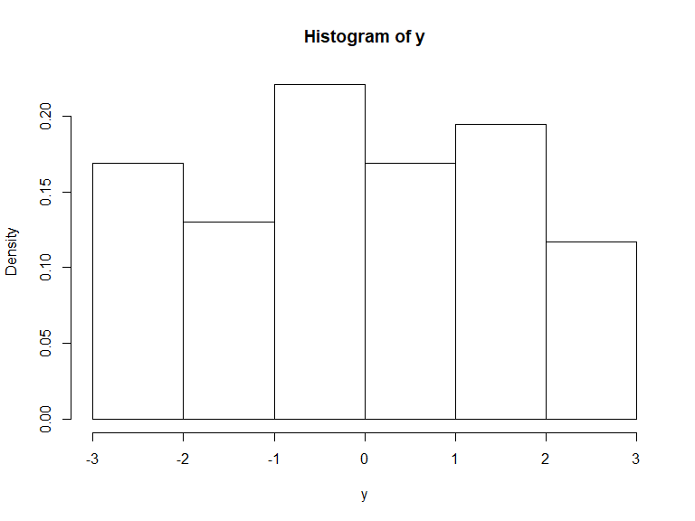

Homework 1 - Monte Carlo Methods
================
Jared Garfinkel - jsg2145

# Problem 1

The standard Laplace distribution has density
\[f(x) = 0.5e^{-|x|}, x \in
(-\infty, \infty)\]. Please provide an algorithm that uses the inverse
transformation method to generate a random sample from this
distribution. Use the \(U(0,1)\) random number generator in 

# Answer: your answer starts here…

X = \(F^{-1}(U)\)

\= \(F(x)\)

\(f(x) = 0.5e^{-|x|},~x \in(-\infty, \infty)\)

``` r
set.seed(123)
U <- runif(1000)
X <- (U < 0.5) * log(2*U) + (U >= 0.5) * -log(2-2*U)

plot(X)
```


``` r
hist(X, prob = T)
```


\#Problem 2

Use the inverse transformation method to derive an algorithm for
generating a Pareto random number with \(U\sim U(0,1)\), where the
Pareto random number has a probability density function
\[f(x; \alpha, \gamma)=\frac{\gamma\alpha^{\gamma}}{x^{\gamma+1}} I\{x\ge \alpha\}\]
with two parameters \(\alpha >0\) and \(\gamma>0\). Use visualization
tools to validate your algorithm (i.e., illustrate whether the random
numbers generated from your function truely follows the target
distribution.)

\[F(x) = 1 - \left(\frac{\alpha}{x}\right)^{\gamma},~x \ge \alpha,~\alpha > 0,~\gamma > 0\]

\[x = \frac{\alpha}{(1-u)^{1/\gamma}}\]

# Answer: your answer starts here…

``` r
set.seed(1001)
U <- runif(1000)
xdens = function(gamma = 5, alpha = 2, x = U) {
  alpha/((1-U)^(1/gamma))
}

x <- xdens(5, 2, U)

hist(x, prob = T)
```


\#Problem 3

Construct an algorithm for using the acceptance/rejection method to
generate 100 pseudorandom variable from the pdf
\[f(x) = \frac{2}{\pi \beta^2} \sqrt{\beta^2-x^2}, \,\, -\beta \le x \le \beta.\]
The simplest choice for \(g(x)\) is the \(U(-\beta, \beta)\)
distribution but other choices are possible as well. Use visualization
tools to validate your algorithm (i.e., illustrate whether the random
numbers generated from your function truely follows the target
distribution.)

# Answer: your answer starts here…

``` r
set.seed(1001)

accrej <- function(fdens, gdens, beta, M = (4/pi), x){
  x = runif(100, min = -beta, max = beta)
  return(x[runif(length(x)) <= fdens(x, beta) / (M * gdens(x, beta))])
}

xdens = function(x, beta){
  return((2/(pi*beta^2))*sqrt(beta^2 - x^2) * (abs(x) <= beta))
}

unifdens = function(x, beta){
  return((1/(2*beta))*(abs(x) <= beta))
}


y = accrej(xdens, unifdens, 3, 4/pi)

hist(y, prob = T)
```



\#Problem 4

Develop two Monte Carlo methods for the estimation of
\(\theta=\int_0^1 e^{x^2} dx\) and implement in 

# Answer: your answer starts here…

``` r
n = 10000
u = runif(n)
y = sum(exp(u^2))/n
x = median(exp(u^2))

xy = tibble(
  median = x,
  mean = y
) %>% 
  knitr::kable()
```

\#Problem 5

Show that in estimating \(\theta=E\sqrt{1-U^2}\) it is better to use
\(U^2\) rather than \(U\) as the control variate, where
\(U\sim U(0,1)\). To do this, use simulation to approximate the
necessary covariances. In addition, implement your algorithms in 

## Using U^2 the variance is lower than using U as the control variate

The variance is lower for u^2 (-4.43) than for u (-4.09) as the control
variate as shown below.

``` r
gfun<-function(x){ 
  sqrt(1 - x^2)
}
mfun<-function(x) {
  x^2
}
mfun2<-function(x) {
  x
}
set.seed(123)
uran<-runif(10000)
ga<-gfun(uran)
ma<-mfun(uran)
ma2<-mfun2(uran)
```

``` r
theta1<-mean(ga)
theta2<-mean(ma2)
hha<- pi/4 + (ga-ma)
hha2<- pi/4 + (ga-ma2)
theta1a<-mean(hha)
theta2a<-mean(hha2)

c(var(ga), var(hha))
```

    ## [1] 0.04848323 0.26344282

``` r
c(var(ga), var(hha2))
```

    ## [1] 0.04848323 0.24693579

``` r
(var(ga)-var(hha))/var(ga)
```

    ## [1] -4.43369

``` r
(var(ga)-var(hha2))/var(ga)
```

    ## [1] -4.093221

\#Problem 6 Obtain a Monte Carlo estimate of
\[\int_1^\infty \frac{x^2}{\sqrt{2\pi}} e^{-\frac{x^2}{2}} dx\] by
importance sampling and evaluate its variance. Write a 

## Use a normal distribution to implement importance sampling on the function above.

I generated a random sample of a uniform distribution from 0 to 1.

``` r
ncandidates <- 100000;  
M <- exp(-1)
u = runif(ncandidates)
x <- rnorm(ncandidates)
Mfun <- function(x){
  x^2*exp(-x^2/2)/sqrt(2*pi)
}
pfun <- function(x){
  dnorm(x)
}
accrej <- function(Mfun, pfun, M, x){
  ncandidates = length(x)
  u = rexp(ncandidates)
  accepted <- NULL      # Initialize the vector of accepted values
  for(i in 1:ncandidates) {
    if(u[i] <= Mfun(x[i])/(M*pfun(x[i])))
      accepted <- c(accepted, x[i])  # Accept x[i]
  }
  return(accepted)
}

y = accrej(Mfun, pfun, 1/exp(1), x)

hist(u)
hist(y, prob = T)

sum(y*(y>1))/length(y*(y>1))
```
